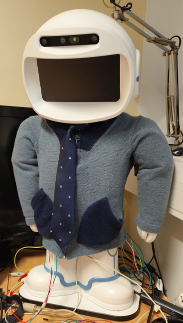

# Analyse Multimodale de l'Interaction avec le Robot QT : Pipeline interactif et intégration haptique

[](../README.md)



## Présentation du Projet

Ce dépôt contient le code qui permet d'exécuter le pipeline interactif avec le robot QT sur trois scénarios distincts.

Il s'agit d'un projet réalisé dans le cadre de mon Master 1 à l'**Université de Montpellier**, supervisé par **Madalina Croitoru** et **Ganesh Gowrishankar**. 
L'objectif principal est de concevoir et valider l'intégration d'une veste haptique grâce à un pipeline bimodal (vision + toucher) afin d'interagir avec les enfants.

**Titre de ma soutenance :** *Analyse Multimodale de l'Interaction avec le Robot QT: Pipeline interactif et intégration haptique*

## Tutoriel d'installation

Il y a deux environnements prévus pour ce projet : un ordinateur classique (Windows) ou directement sur le robot QT.

### 1. Sur un ordinateur classique (Windows)

```cmd
git clone https://github.com/Juste-Leo2/QTRobot-Interaction.git
cd QTRobot-Interaction

setup_env_win.bat
run_win.bat
```
*Et c'est bon : cela ne prend pas en compte la veste haptique, ni l'environnement ROS. Du coup, le pipeline utilise des affichages console (`print`) pour compenser.*

### 2. Sur le robot QT

**Préparation du matériel :**
Pour les branchements de la veste haptique, veuillez vous référer à [ce guide](https://github.com/Juste-Leo2/QT-Touch/blob/main/raspberry_inference/README.md).

```bash
git clone https://github.com/Juste-Leo2/QTRobot-Interaction.git
cd QTRobot-Interaction

chmod +x setup_env_qt.sh
./setup_env_qt.sh
```
*Cette commande installe les pré-requis `apt`, `uv`, crée l'environnement et installe les dépendances nécessaires.*

Une fois l'installation terminée, exécutez directement :
```bash
uv run main.py --QT --scenario 1
```
*(Vous pouvez remplacer `1` par le scénario `2` ou `3` selon le besoin)*

**Options supplémentaires :**
- L'ajout de l'argument `--follow` permet d'activer le suivi du visage par le robot QT.

## Remerciements

Je tiens à remercier :
- Mes tuteurs de projet (Madalina Croitoru et Ganesh Gowrishankar)
- La communauté open source : [Piper TTS](https://github.com/rhasspy/piper), [PyTorch](https://pytorch.org/)
- L'équipe de Lux AI pour le développement de la veste
- L'Université d'Aalto en Finlande pour avoir fourni la veste haptique pour ces recherches

## Licence

Ce projet est sous licence [Apache 2.0](../LICENSE).
